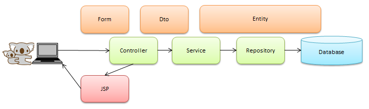

# spring5_jpa

* SpringMVCとJPAを学ぶ。  
* トランザクションを学ぶ。  
* 親テーブル、子テーブルを学ぶ。  
* 排他制御（悲観的、楽観的）を学ぶ。  
* デッドロック防止を学ぶ。  
* lombokを知る。  
* gradleに挑戦。  
* Hibernateで自動テーブル作成を使う。  
* etc  

## Dependencies
* org.springframework:spring-webmvc:5.2.6.RELEASE  
* org.springframework.data:spring-data-jpa:2.3.0.RELEASE  
* org.hibernate:hibernate-entitymanager:5.4.16.Final  
* org.hibernate.validator:hibernate-validator:6.1.5.Final  
* com.fasterxml.jackson.core:jackson-databind:2.11.0  
* javax.servlet:jstl:1.2  
* org.slf4j:slf4j-nop:1.7.30  
* org.postgresql:postgresql:42.2.12  
* javax.servlet:javax.servlet-api:3.1.0  

## Plugin
* com.bmuschko:gradle-tomcat-plugin:2.5  
* io.freefair.gradle:lombok-plugin:5.1.0  

## Environment
* JDK 11
* PostgreSQL 11
* Tomcat 9

## Tree
```
├── README.md
├── build.gradle
└── src
    └── main
        ├── java
        │   └── demo
        │       ├── controller
        │       │   ├── ProjectForm.java
        │       │   ├── ProjectParentAndChildController.java
        │       │   ├── ProjectTransactionController.java
        │       │   └── RestProjectController.java
        │       ├── dto
        │       │   └── ProjectDto.java
        │       ├── entity
        │       │   ├── Member.java
        │       │   └── Project.java
        │       ├── repository
        │       │   ├── MemberRepository.java
        │       │   └── ProjectRepository.java
        │       └── service
        │           ├── MemberService.java
        │           └── ProjectService.java
        ├── resources
        │   └── META-INF
        │       ├── messages
        │       │   ├── messages.properties
        │       │   └── messages_ja.properties
        │       └── spring
        │           ├── applicationContext-beans.xml
        │           └── applicationContext-webmvc.xml
        └── webapp
            ├── WEB-INF
            │   ├── views
            │   │   └── project
            │   │       ├── parentAndChild.jsp
            │   │       └── transaction.jsp
            │   └── web.xml
            └── index.jsp
```
## Flow


## 環境
基本的には以下の4つがあれば起動する。  
※組み込みTomcatを使うので、事前にTomcatをインストールする必要無し。  

* cloneしたこのspring5_jpaプロジェクト  
* JDK 11 ※OpenJDKでも、OracleJDkでもOK  
* PostgreSQL 11 ※OracleでもOK。Oracle用の接続設定は別ブランチにあり  
* gradle 6系 ※gradlewラッパーでもOK  

### ツール、開発環境など  
* GitBash  
* IntelliJ IDEA Community版  ※Pleiades All in OneでもOK  


## Install java
* JDK 11がインストールされていること  

OpenJDK11のインストール方法メモ  
https://qiita.com/shibafu/items/8762636f66d7fef49d59  

## Install PostgreSQL
* PostgreSQL 11がインストールされていること  

PostgreSQLをWindowsにインストールする方法  
https://intellectual-curiosity.tokyo/2019/04/11/postgresql%E3%82%92windows%E3%81%AB%E3%82%A4%E3%83%B3%E3%82%B9%E3%83%88%E3%83%BC%E3%83%AB%E3%81%99%E3%82%8B%E6%96%B9%E6%B3%95/  

Dockerを使ってPostgreSQLを立て、テーブルを作成する。  
https://swiswiswift.com/2019-11-22/  

## Install IntelliJ IDEA
* IntelliJ IDEA Community版がインストールされていること  

IntelliJ IDEAをインストールする  
https://pleiades.io/help/idea/installation-guide.html  


## Install Gradle
※IntelliJにプロジェクトをimportする際に、勝手にGradlewラッパーが入るので、Gradleのインストールは不要かも。  

https://gradle.org/  

Windows10にGradleをインストール  
https://qiita.com/quwahara/items/9c4e5fbda421cfcb09ad  
Gradle入門  
https://qiita.com/vvakame/items/83366fbfa47562fafbf4  

プロキシ環境で作業する場合は、以下を参考にプロキシ設定する  

gradleのプロキシ設定  
https://qiita.com/koooge/items/294e6a1000d99d92ae72  

## Install gitbash

自分用 Git For Windowsのインストール手順  
https://qiita.com/toshi-click/items/dcf3dd48fdc74c91b409  

## Clone Github repository
Open the Command Prompt.  
```
任意のディレクトリで、以下コマンドを実行する。
git clone https://github.com/namickey/spring5_jpa.git
```

## Import to Eclipse
Eclipseにインポートして、開発を始めよう。  

GradleプロジェクトをEclipse、IntelliJ IDEA両対応で開発する  
https://qiita.com/grachro/items/cb169b9da433ea038cad#eclipse-%E3%81%B8%E3%83%97%E3%83%AD%E3%82%B8%E3%82%A7%E3%82%AF%E3%83%88%E3%82%92%E3%82%A4%E3%83%B3%E3%83%9D%E3%83%BC%E3%83%88  

## Install and Setting Lombok
https://projectlombok.org/  

Eclipse：lombokインストール手順  
https://web-dev.hatenablog.com/entry/eclipse/lombok  
【Java】Lombokで冗長コードを削減しよう  
https://www.casleyconsulting.co.jp/blog/engineer/107/  


## Setting Database
### for PostgreSQL
* masterブランチをチェックアウト。※clone直後はmasterブランチになっている  
* masterブランチには、PostgreSQLへ接続設定済み。以下の接続情報は環境に合った内容に変更すること。  

https://github.com/namickey/spring5_jpa/blob/master/src/main/resources/META-INF/spring/applicationContext-beans.xml
```
<property name="jpaProperties">
    <props>
        <prop key="hibernate.hbm2ddl.auto">create-drop</prop>
        <prop key="hibernate.dialect">org.hibernate.dialect.PostgreSQLDialect</prop>
    </props>
</property>

接続情報
<property name="driverClassName" value="org.postgresql.Driver" />
<property name="url" value="jdbc:postgresql://localhost:5432/postgres" />
<property name="username" value="postgres" />
<property name="password" value="postgres" />
```

https://github.com/namickey/spring5_jpa/blob/master/build.gradle
```
compile ("org.postgresql:postgresql:42.2.2")
```


### for Oracle
* oracleブランチをチェックアウト。※masterブランチからoracleブランチへ切り替える  
* oracleブランチには、Oracleへ接続設定済み。以下の接続情報は環境に合った内容に変更すること。  

https://github.com/namickey/spring5_jpa/blob/oracle/src/main/resources/META-INF/spring/applicationContext-beans.xml
```
<property name="jpaProperties">
    <props>
        <prop key="hibernate.hbm2ddl.auto">create-drop</prop>
        <prop key="hibernate.dialect">org.hibernate.dialect.DataDirectOracle9Dialect</prop>
    </props>
</property>

接続情報
<property name="driverClassName" value="oracle.jdbc.driver.OracleDriver" />
<property name="url" value="jdbc:oracle:thin:@localhost:1521:xe" />
<property name="username" value="sample" />
<property name="password" value="sample" />
```

https://github.com/namickey/spring5_jpa/blob/oracle/build.gradle
```
compile ("com.oracle:ojdbc6:12.1.0.1-atlassian-hosted")
```

## 参考：jpaPropertiesについて
* 「hibernate.hbm2ddl.auto」の機能によって、組み込みTomcat起動時に定義されているEntityに合わせて、テーブルが作成される。  
* 組み込みTomcat停止時にはテーブルが削除される。  

https://github.com/namickey/spring5_jpa/blob/master/src/main/resources/META-INF/spring/applicationContext-beans.xml
```
<property name="jpaProperties">
    <props>
        <prop key="hibernate.hbm2ddl.auto">create-drop</prop>
        <prop key="hibernate.dialect">org.hibernate.dialect.DataDirectOracle9Dialect</prop>
    </props>
</property>
```
* 特にjpaPropertiesは、このままの設定で問題ないが、必要であれば切り替える  
* 「create-drop」が指定されている場合、事前にデータベースにテーブルを作成しておく必要無し。  
```
create - スキーマの作成
update - 既存のスキーマの更新
validate - 既存のスキーマを検証する
create-drop - セッションの開始と終了時にスキーマを自動的に作成して削除する
```

## Start Command
Open the Command Prompt.  
```
「build.gradle」ファイルが存在するディレクトリへ移動する。
cd spring5_jpa
```
```
gradle tomcatRun
```
ブラウザで以下のURLにアクセスする。  
http://localhost:8080/demo  

## Stop Command
```
Ctrl + C

※どうしても停止させてもバックグラウンドでJAVAプロセスが残って、8080ポートをつかんだままになる。
その場合は、そのJAVAプロセスをKILLする必要あり。
```

## Let's challenge ! !
* 自分のgitアカウントにプロジェクトを作成して、写経する。  
* エンティティ、リポジトリ、サービス、コントローラ、JSP等を作り変える。  
* 親子テーブルでCRUD（insert,select,update,delete）を実装する。  
* 悲観的排他、楽観的排他を実装する。以下サイト参考。  
  http://terasolunaorg.github.io/guideline/5.4.1.RELEASE/ja/ArchitectureInDetail/DataAccessDetail/ExclusionControl.html  
* デッドロックを起こしてみる。  
* 様々な方法で、採番を行う。  
  https://qiita.com/kawasima/items/6b0f47a60c9cb5ffb5c4  
* etc  
